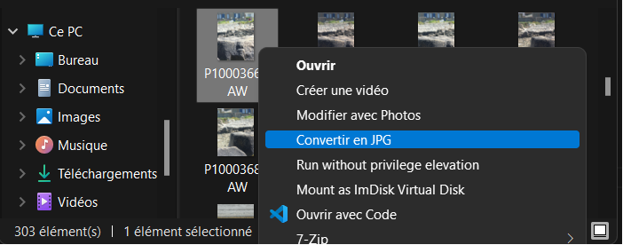
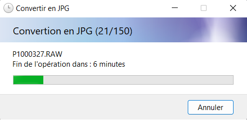

RAWtoJPG
============

This is a windows shell extension to (batch) convert RAW files to JPG.





Build
-----

* Install MSVC
* Start MSVC console
* Run ```build_msvc.bat``` from the MSVC console

Package/install
-------

* Install WiX
* Run ```package.bat``` to create the msi file
* Run ```msiexec /i rawtojpg-setup.msi``` to install

* Right click on a raw file en click ```Convert to JPG```

* Run ```msiexec /x rawtojpg-setup.msi``` to uninstall

* (while making changes, you might need to restart ```explorer.exe``` to unlock ```RAWtoJPG.dll```)

TODO
----
* Try concurrent convertion
* "Replace All" function
* Encoder Options config ([WIC](https://docs.microsoft.com/en-us/windows/win32/wic/-wic-creating-encoder#encoder-options-usage))
* Better file association (try to find why PerceivedType image does not work)